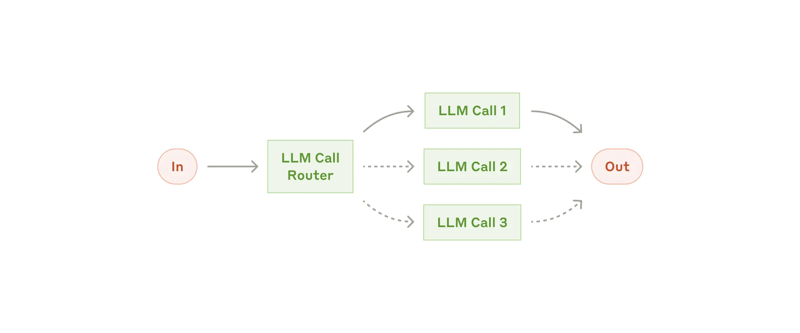

# Workflow Agents in the Enterprise (Popular Architectures & Examples)

We learned quite a bit about prompting LLMs in the last lesson. By orchestrating LLMs in defined workflows, we can build end-to-end use cases—what many call workflow agents (or, in some circles, “agentic” systems). But let’s not get bogged down in the terminology.

There are several popular design patterns for building workflow agents. Below are a few examples. Keep in mind, these aren’t the only options—you can always invent your own. The key idea is that in workflows, you’re the one doing the planning. AI models are here to understand and generate knowledge; planning is up to you.

---

## Workflow: Prompt Chaining

Prompt chaining breaks a task into a sequence of steps, where each LLM call processes the output from the previous one. You can also add programmatic checks (the “gate” in the diagram) at any stage to ensure the process stays on track.

**When to Use It:**
Ideal for tasks that can be neatly divided into fixed subtasks. This approach trades off latency for higher accuracy, as each LLM call becomes a simpler, more manageable task.

### Enterprise Use-Cases:

In Healthcare, You could build a Treatment Plan Development workflow using prompt chaining: start by reviewing a patient’s history, then identify key risk factors, and finally craft a treatment strategy. You could also develop a Medical Report Summarization workflow where you take extensive clinical notes, lab reports, and imaging findings, and sequentially summarize them into concise reports that busy clinicians can easily digest.

In Supply Chain, consider an Order Processing workflow that chains prompts to verify order details, check current inventory levels, and confirm shipping schedules—ensuring that each step is validated before moving on. Alternatively, you might build a Supplier Evaluation workflow that walks through performance metrics, delivery records, and quality assessments step by step to generate a reliable ranking of suppliers.

In Manufacturing, you could create a Process Improvement workflow that analyzes production data in stages to identify bottlenecks, diagnose root causes, and suggest targeted process enhancements designed to boost overall efficiency.

For marketing efforts in your enterprise, you could also develop a Campaign Strategy Development workflow that begins with broad market research, then refines target audience segmentation, and finishes by developing tailored messaging for a cohesive campaign. Additionally, a Content Generation workflow could generate headlines first, then supporting copy, and finally call-to-action elements—ensuring that every piece aligns seamlessly with the overall campaign strategy.

## Workflow: Routing

Routing involves classifying an input and directing it to a specialized follow-up task. This design separates concerns by allowing you to build specialized prompts tailored for different input categories. Without routing, optimizing for one type of input might hurt performance on others.

When to Use It:
Best suited for complex tasks that involve distinct categories. If you can accurately classify the inputs—whether by an LLM or a traditional algorithm—routing can improve overall performance.

### Enterprise Use-Cases:

In Healthcare, you could develop a Triage Systems workflow that automatically classifies patient symptoms and routes them to the appropriate specialist—be it cardiology, neurology, or another department—based on the urgency and nature of the issue. Another option is an Insurance Claims Processing workflow that directs claims to different review teams depending on the type of treatment or procedure, thereby streamlining the entire review process.

In Finance, consider a Customer Support workflow that automatically classifies and routes client queries—whether they pertain to loan applications, account issues, or investment advice—to the specialized department best equipped to handle them. This not only ensures a faster response but also increases the accuracy of the support provided.

---

## Workflow: Parallelization

LLMs can sometimes work on tasks simultaneously, with their outputs aggregated programmatically. There are two main forms:

Sectioning: Dividing a task into independent subtasks that run in parallel.

Voting: Running the same task multiple times to gather diverse outputs.

When to Use It:
Effective when tasks can be split for speed or when you need multiple perspectives for higher-confidence results. For complex tasks with many factors, separate LLM calls can focus on individual aspects, improving overall quality.

### Enterprise Use-Case:

**Marketing:**
Let's say you're running a marketing campaign, you could develop a Campaign Performance Monitoring workflow that simultaneously analyzes various metrics such as click-through rates, engagement, and conversions in parallel using a parallel workflow agent. This approach delivers comprehensive view of performance, empowering you to adjust strategies on the fly.

---

## Workflow: Orchestrator-Workers

In the orchestrator-workers pattern, a central LLM dynamically breaks down tasks, delegates them to worker LLMs, and then synthesizes the results.

When to Use It:
This workflow shines for complex tasks where you can’t predict the necessary subtasks in advance. For example, in coding, the number of files to change and the type of changes often depend on the specific task. Unlike simple parallelization, this method’s flexibility allows the orchestrator to determine the required subtasks based on the input.

---

When designing your workflows, always ask yourself:
**“What’s the best performance I can achieve with this system?”**
The answer depends on your data, the task, and how you balance speed, cost, and accuracy. These workflow patterns are simple yet powerful tools to get you started—and with creativity, you can tailor them to any enterprise need.

Think about use cases in your industry that could benefit from these workflows—or invent new ones!

---

**Images & Terms courtesy of:**
👉 [Anthropic: Building Effective Agents](https://www.anthropic.com/engineering/building-effective-agents)

---

